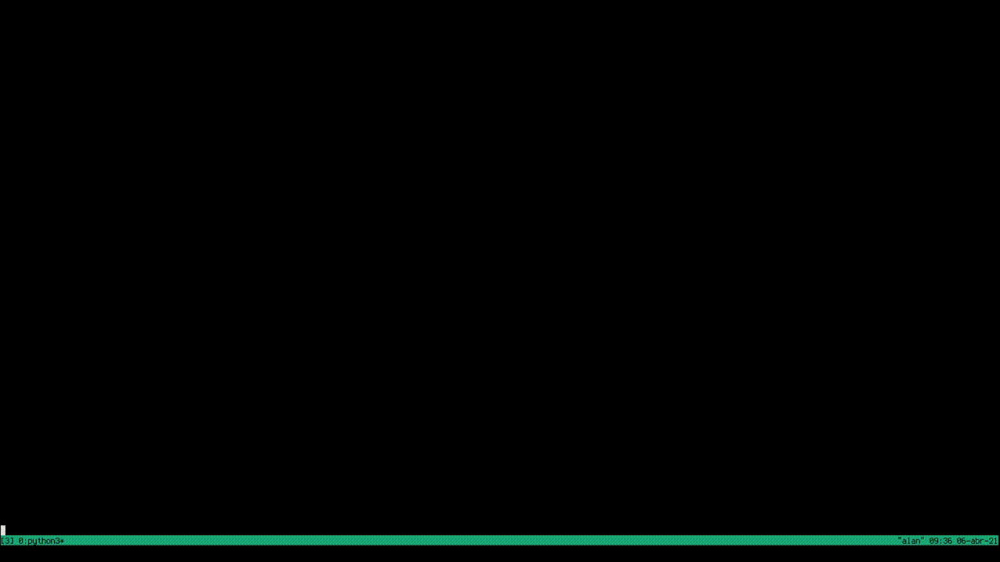

# ascii-video-converter

## Preview

<div style="display: table;">
	
	
</div>

## Welcome
To full-fill my SECOND personal desires (run bad apple in my shell) I created this video to UTF-8 converter. It's a python script that get an MP4 file and transform into a folder full of ascii-art.

## Requirements (python library)

### Local

- opencv-python
- numpy

### Docker

- docker

## Usage

### Local

First, generate the "video-txt" folder in "create-video".

```
./create-video/asciiVideo videoPath
```

Second, run the video in the "run-video" folder.

```
./run-video/runVideo
```

### Docker

First, build the images:

```
make build
```

Second, run the script:

```
./run-docker.sh /absolute/path/to/video.mp4
```
